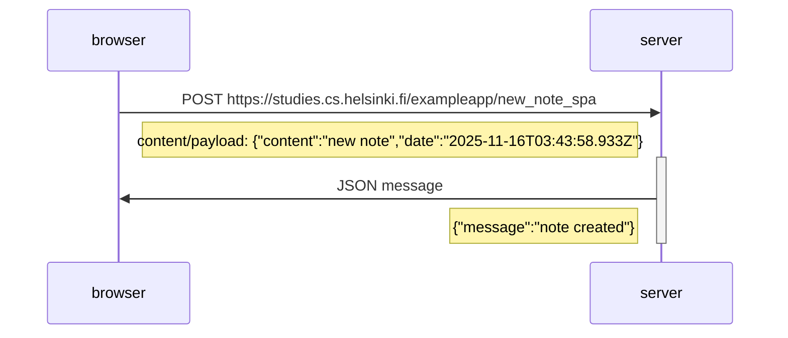

```mermaid
sequenceDiagram
  participant browser
  participant server

  browser->>server: POST https://studies.cs.helsinki.fi/exampleapp/new_note_spa

  Note right of browser: content/payload: {"content":"new note","date":"2025-11-16T03:43:58.933Z"}

  activate server
  server->>browser: JSON message

  Note left of server: {"message":"note created"}
  deactivate server
```
